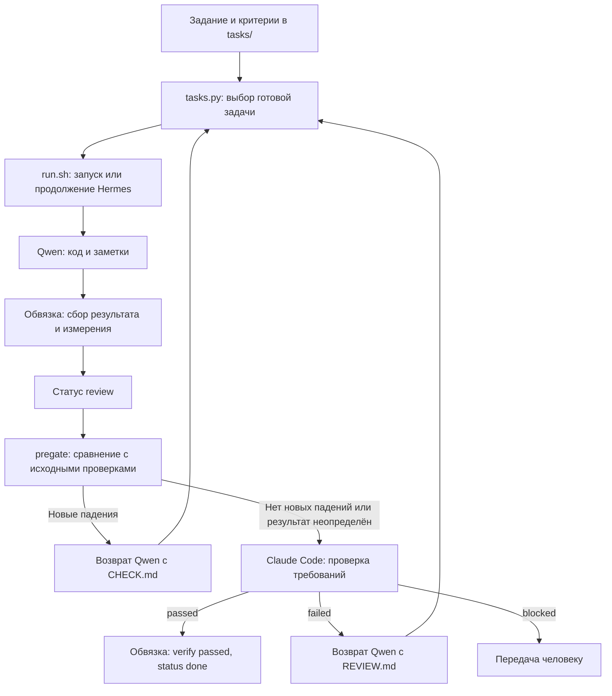

# Hermes Harness: исследование стека и план повышения надёжности

Дата: 21 сентября 2026 года.

Исследованный commit харнесса: `6af3c16a36cf028bfe322a98c8181ff380dc925c`.

Статус: отчёт и предложение к реализации. Изменения рабочего кода, конфигурации сервера и установленных компонентов в рамках исследования не выполнялись.

## 1. Цель системы и порядок приоритетов

Система предназначена для программирования в проектах, где допустимо длительное выполнение задач. Постановщик заранее описывает задачу и критерии приёмки. Локальная Qwen пишет код через Hermes Agent. Claude Code независимо проверяет, выполнена ли задача правильно. Это позволяет расходовать оплаченные токены преимущественно на проверку результата, оставляя основную работу локальной модели.

Обвязка нужна потому, что исполнитель способен уверенно сообщить о завершении, когда требуемое поведение отсутствует, проверки не выполнялись или обнаруживают ошибки. Проектировать систему следует вокруг свойства: **отчёт исполнителя не может сам стать основанием для завершения задачи**.

Приоритеты:

1. Правильность реализации и обоснованность приёмки.
2. Независимость задания, измерений и вердикта от самооценки исполнителя.
3. Стоимость Claude на корректно принятую задачу, включая повторные и неудачные ревью.
4. Способность Qwen самостоятельно исправляться по конкретным замечаниям.
5. Сохранность результатов и восстановление после остановок.
6. Скорость выполнения, если её улучшение не ухудшает предыдущие показатели.

Практическая цель не сводится к минимальному числу вызовов Claude: пропущенная ошибка может сделать экономию фиктивной. Также нельзя считать все задачи со статусом `done` корректными только на основании этого статуса. Для оценки качества системы нужны задачи с известными критериями и выборочная независимая перепроверка принятых результатов.

Модель может ошибаться и преувеличивать. Обвязка должна ограничить последствия: неподтверждённое утверждение остаётся утверждением, противоречивый вердикт отклоняется, а переход в `done` требует проверяемого основания.

## 2. Область исследования и достоверность выводов

Изучены все основные скрипты репозитория, конфигурация, хуки и эксплуатационные документы. Исходники официальных релизов Hermes и llama.cpp скачаны во временные каталоги для чтения; отдельно рассмотрены более свежие ветки upstream. Прочитана официальная карточка Qwen и первичные сообщения о проблемах сервинга.

Конфигурация из [model-serving.md](model-serving.md), [operating.md](operating.md) и [config.yaml](../config.yaml) принята за исходную конфигурацию пользователя. Повторно выяснять уже описанные параметры для составления этого отчёта не требуется.

На удалённый сервер исследователь не подключался. Производительность RTX 5090, фактическая загрузка памяти, установленный драйвер, загруженный GGUF и реальные ответы сервера в этом исследовании не измерялись. Числа, приведённые в существующих документах как результаты эксплуатации, не выдаются здесь за новые измерения.

В отчёте различаются четыре вида утверждений:

| Обозначение | Значение |
| --- | --- |
| Воспроизведено | Поведение проверено локально на небольшом изолированном примере без вызова моделей. |
| Подтверждено кодом | Видно из соответствующей реализации, но полный сценарий на сервере не запускался. |
| Подтверждено документацией | Возможность или рекомендация описана автором компонента. Это не замер данной установки. |
| Гипотеза / эксперимент | Возможный выигрыш требует сравнения на реальных задачах. |

### Зафиксированные версии

| Компонент | Исходная версия | Дополнительно исследовано |
| --- | --- | --- |
| Hermes Agent | `0.21.3`, `v2026.9.14`, commit `345cd2b057a452236de401d3534b8502a7465e8d` | Снимок `main`: `f4c83fea4485030782c6e0f5680a2fa9196bd3b2`, 20 сентября. |
| llama.cpp | `5b59b83f4e2101ea173d4f853a0522d9971f48c6`, 19 сентября | Релиз `v0.4.1`: `b29c606e28a01b1bc8c1351026a0fa6e616bf6c4`; снимок `master`: `ce8caa6e60a03093351d6016a818720e0d46f0fb`, 20 сентября. |
| Модель | `Qwen/Qwen3.8-27B`; GGUF из `unsloth/Qwen3.8-27B-GGUF`, Q6_K по документу | Карточка модели и актуальный каталог файлов Unsloth. В каталоге 22-ГБ вариант называется `Qwen3.8-27B-UD-Q6_K.gguf`. |
| Сервер | RTX 5090, 32 ГБ; `llama-server`, CUDA/WSL2 по документу | Физическая установка не обследовалась. |
| Ревьюер | Claude Code; `opus` по умолчанию, `sonnet` как fallback в `review.sh` | Семантика разрешений по официальной документации. Установленный на сервере CLI не запускался. |

На момент проверки `v2026.9.14` был последним опубликованным релизом Hermes. Наличие более свежего `main` само по себе не является рекомендацией обновляться. Сравнения привязаны к указанным SHA: подвижное имя ветки не воспроизводит исследованный снимок. Источники: [Hermes release](https://github.com/NousResearch/hermes-agent/releases/tag/v2026.9.14), [llama.cpp release](https://github.com/ggml-org/llama.cpp/releases/tag/v0.4.1), [сборка сервера](https://github.com/ggml-org/llama.cpp/commit/5b59b83).

## 3. Текущая архитектура



Основные компоненты:

| Файл | Ответственность |
| --- | --- |
| [tasks.py](../tasks.py) | Чтение задач и меток, зависимости, приоритеты, очередь ревью, формирование prompt и NOTES. |
| [run.sh](../run.sh) | Попытки выполнения, продолжение сессии, сбор заметок, запуск проверок, передача в review, коммит. |
| [review.sh](../review.sh) | Сбор дифа, проверка проекта и baseline, запуск Claude Code, переходы после вердикта. |
| [pregate.py](../pregate.py) | Сравнение множеств ошибок тестов. Может вернуть задачу; не принимает её окончательно. |
| [verdict.py](../verdict.py) | Разбор ответа Claude, определение пригодности ревью, сохранение REVIEW и NOTES. |
| [hooks/guard-paths.py](../hooks/guard-paths.py) | Эвристический запрет доступа к защищённым путям через инструменты исполнителя. |
| [hooks/guard-notes.py](../hooks/guard-notes.py) | Побуждение заполнить заметки перед остановкой после изменений файлов. |
| [hooks/guard-read.py](../hooks/guard-read.py) | Ограничение некоторых больших чтений через terminal. |
| [status.sh](../status.sh) | Сводка статусов, переходов, счётчиков и стоимости ревью. |

### Что уже работает в пользу основной цели

- Исполнитель и ревьюер разделены; обычный путь `run.sh` не выставляет `verify: passed`.
- Требования задачи передаются непосредственно в prompt, а замечания ревью — в следующую попытку.
- Есть сравнение тестов с исходным состоянием: существующая ошибка проекта не автоматически приписывается исполнителю.
- Непригодное ревью сохраняется отдельно от последнего пригодного.
- Есть продолжение сессий, счётчики попыток и возвратов, журнал переходов.
- NOTES уже организованы как форма по критериям, а не свободное заявление «всё сделано».

Эти решения целесообразно сохранить. Исправления должны укреплять их проверяемость и согласованность.

## 4. Результаты сверки с Hermes, llama.cpp и Qwen

### 4.1. Передача reasoning между ходами

**Подтверждено кодом; поведение функции воспроизведено.** Hermes 0.21.3 умеет сохранять `reasoning_content`, но на обычном custom-маршруте удаляет это поле из последующих API-запросов, если не включён `model.reasoning_echo`. В конфигурации харнесса этот параметр отсутствует; его стандартное значение в Hermes — `false`.

Проверка функции `apply_reasoning_content_policy` из релиза дала:

```text
reasoning_echo = False -> reasoning_content replayed: False
reasoning_echo = True  -> reasoning_content replayed: True
```

Отсутствие параметра в шаблоне не доказывает его отсутствие в уже объединённой конфигурации установки: установщик сохраняет дополнительные пользовательские ключи. Для воспроизводимого запуска значение следует сделать наблюдаемым. Источники: [reasoning policy](https://github.com/NousResearch/hermes-agent/blob/v2026.9.14/agent/reasoning_params.py), [обработка истории](https://github.com/NousResearch/hermes-agent/blob/v2026.9.14/agent/message_sanitization.py).

Qwen3.8 рекомендует сохранять reasoning в истории для последовательности решений и использования KV-кэша. У модели есть `reasoning_effort` со значениями `xhigh`, `medium`, `low`; по карточке стандартное значение — `xhigh`. Более низкий effort может уменьшить время одного ответа, но увеличить количество ошибок и повторов. Указанные в проекте temperature/top-p/top-k/min-p для thinking соответствуют карточке. Источник: [Qwen3.8-27B, API и best practices](https://huggingface.co/Qwen/Qwen3.8-27B).

**Предлагаемый эксперимент:** проследить цепочку «полученный reasoning → сохранённая сессия → следующий запрос → отрендеренный сервером prompt», включая resume. Затем сравнить качество и стоимость задач с replay и без него. Прирост производительности заранее не обещается. Дополнительно проверить, учитывает ли оценка контекста Hermes фактически передаваемую историю после включения opt-in.

### 4.2. Сжатие контекста

**Подтверждено кодом; расчёт воспроизведён.** При описанной конфигурации `context_length: 131072`, стандартном ratio `0.5`, отсутствии `max_tokens` и абсолютного ограничения компрессор релиза вычисляет порог **98 304 токена**. Для окон меньше 512 000 процентный порог повышается минимум до 75%.

В `operating.md` указан приблизительный порог 65 тысяч — это расходится с реализацией. Формулировка README «75% независимо от настройки» также неполна: более высокий ratio сохраняется, существует `compression.threshold_tokens`, а резерв ответа влияет на расчёт. Источник: [ContextCompressor в исследованном релизе](https://github.com/NousResearch/hermes-agent/blob/345cd2b057a452236de401d3534b8502a7465e8d/agent/context_compressor.py).

Рекомендуется исправить описание и логировать эффективный порог. Снижать его без сравнения задач не следует: сжатие тратит вычисления и может потерять детали задания. Абсолютный предел — доступный штатный инструмент для эксперимента, если длинный контекст действительно ухудшает работу данного сервера.

### 4.3. Определение рабочего контекста сервера

**Подтверждено кодом.** Hermes умеет обращаться к llama.cpp `/props`, читать рабочий `n_ctx` и согласовывать ранее сохранённое значение. Утверждение «не спрашивает сервер и всегда предполагает 131072 для qwen» устарело. Явный `model.context_length` имеет приоритет, поэтому неправильная ручная настройка всё ещё возможна. Минимум 64 000 токенов остаётся в реализации. Источник: [model_metadata.py](https://github.com/NousResearch/hermes-agent/blob/v2026.9.14/agent/model_metadata.py).

Практический вывод: сохранить явную настройку для воспроизводимости, но проверять её соответствие серверу. Ответ `/v1/models` подтверждает доступность модели; одного его недостаточно для проверки выделенного контекста и корректной работы инструментов.

### 4.4. Завершение хода и повторные попытки

**Подтверждено кодом.** В 0.21.3 уже есть обработка некоторых ответов-намерений без действий, восстановление после части пустых ответов, встроенная проверка перед остановкой и `pre_verify`. Последний вызывается при наличии зарегистрированных изменений файлов и ограничен числом nudges. Поэтому фраза «любая проза немедленно завершает ход» слишком общая. Источники: [завершение ответа](https://github.com/NousResearch/hermes-agent/blob/v2026.9.14/agent/turn_final_response.py), [stop gates](https://github.com/NousResearch/hermes-agent/blob/v2026.9.14/agent/turn_stop_gates.py).

В исследованном `main` после релиза расширены проверки reasoning, заканчивающегося обещанием действия, и обрывочных финальных ответов после работы инструментами. Это близко к описанной в README проблеме преждевременной остановки и обосновывает сравнительный прогон новой версии. Это не доказательство, что внешний resume-цикл больше не нужен. Источник: [исследованный turn_final_response.py в main](https://github.com/NousResearch/hermes-agent/blob/f4c83fea4485030782c6e0f5680a2fa9196bd3b2/agent/turn_final_response.py).

`agent.max_turns: 0` означает практически неограниченный бюджет итераций. `HH_MAX_ATTEMPTS` ограничивает число завершившихся запусков, но не длительность одного запуска. В Hermes есть `--run-budget` / `agent.run_budget_seconds`: изучены уведомление на 80% бюджета и сокращение некоторых неявных тайм-аутов. Этого недостаточно, чтобы обещать жёсткую остановку процесса по времени; явные тайм-ауты имеют отдельную семантику. Источники: [CLI-параметры](https://github.com/NousResearch/hermes-agent/blob/v2026.9.14/hermes_cli/_parser.py), [тесты run budget](https://github.com/NousResearch/hermes-agent/blob/v2026.9.14/tests/agent/test_run_budget.py).

### 4.5. Возможности llama.cpp и границы выводов о скорости

**Подтверждено документацией и кодом.** Исследованный сервер поддерживает `draft-mtp`, положительный `--reasoning-budget`, `--reasoning-effort`, сохранение reasoning и context checkpoints. В релизе Jinja включён по умолчанию; явный `--jinja` остаётся полезным для понятной команды запуска. Важен фактический ответ с native `tool_calls`, а не только наличие флага. Источник: [параметры сервера](https://github.com/ggml-org/llama.cpp/blob/v0.4.1/tools/server/README.md).

Сравнение `v0.4.1` с `5b59b83` не показало изменений в рассмотренных `common/arg.cpp`, `common/chat.cpp`, `common/speculative.cpp`, `common/sampling.cpp`; в `tools/server` различался CMake-файл. Это позволяет применять изученные реализации к сборке, указанной в проекте, в пределах этих файлов.

MTP-реализация уже содержит состояние по последовательностям: утверждение, что MTP в принципе требует ровно один слот, слишком сильное. Для одной локальной модели, одной карты и последовательной очереди `--parallel 1` всё равно разумен. Спекулятивные токены проверяются через sampler основной модели; это не основание обещать идентичность каждого запуска или фиксированный процент ускорения. Источники: [speculative.cpp](https://github.com/ggml-org/llama.cpp/blob/v0.4.1/common/speculative.cpp), [sampling.cpp](https://github.com/ggml-org/llama.cpp/blob/v0.4.1/common/sampling.cpp).

Повторное использование общего префикса и перенос отдельных фрагментов кэша — разные механизмы. В сервере ограничение `cache_reuse` связано с возможностью сдвига памяти контекста и мультимодальностью; сводить его только к MTP неточно. Увеличение числа checkpoints следует обосновывать журналом восстановлений и повторного prefill. Источник: [server-context.cpp](https://github.com/ggml-org/llama.cpp/blob/v0.4.1/tools/server/server-context.cpp).

### 4.6. GGUF, память и драйвер

В каталоге Unsloth есть несколько вариантов с `Q6_K` в названии, отдельный каталог MTP и файлы mmproj. Для воспроизводимости в отчёте о сервере нужны фактически выбранное имя файла, revision источника, checksum и сведения о загрузке MTP. Названия семейства квантизации недостаточно для идентификации артефакта. Скачивание весов в ходе исследования не выполнялось. Источник: [каталог Unsloth](https://huggingface.co/unsloth/Qwen3.8-27B-GGUF/tree/main).

Найден первичный репорт резкого замедления Qwen3.8 на длинном контексте, RTX 4080 SUPER и драйвере 591.86. Он подтверждает существование конкретной проблемы, но сам по себе не доказывает правило «все версии от 591.86 плохие для RTX 5090, 580.x решает проблему». Изменение драйвера не входит в предлагаемые исправления. Нужен воспроизводимый замер на собственной установке. Источник: [llama.cpp issue 27623](https://github.com/ggml-org/llama.cpp/issues/27623).

### 4.7. Что можно взять из Hermes и что требует отдельного решения

| Возможность | Вывод для харнесса |
| --- | --- |
| API hooks | Подходящий штатный источник наблюдений о запросах, usage и завершении. Проверить доступные поля именно установленного релиза. |
| `reasoning_echo` | Кандидат на настройку вместо собственной переработки сообщений. |
| `compression.threshold_tokens` | Штатный способ исследовать абсолютный предел сжатия. |
| Продолжение после незавершённого ответа | Сначала сравнить upstream-исправления, затем решать, какие дополнительные nudges нужны снаружи. |
| `--worktree` | Не подключать механически: основание и время жизни дерева должны совпадать с контрактом харнесса. |
| Kanban | Рассматривать отдельно от текущих фиксов: его источник истины — SQLite, текущего проекта — файловое дерево задач. |

У `--worktree` по умолчанию есть синхронизация основания с remote; очистка CLI в исследованном релизе ориентируется на наличие неопубликованных коммитов. Обвязка же коммитит после завершения Hermes. Поэтому сохранение незакоммиченного результата должно быть проверено до интеграции. Источники: [worktree_ops.py](https://github.com/NousResearch/hermes-agent/blob/v2026.9.14/hermes_cli/worktree_ops.py), [CLI cleanup](https://github.com/NousResearch/hermes-agent/blob/v2026.9.14/cli.py).

В свежем Kanban имеются переходы запроса ревью и возврата замечаний. Это не готовая замена независимому Claude Code и не автоматическая синхронизация с `task.txt` / `labels.txt`. Миграция затрагивает владение статусами, хранение доказательств и модель доверия; она не требуется для устранения найденных ошибок. Источник: [Kanban upstream](https://github.com/NousResearch/hermes-agent/blob/main/website/docs/user-guide/features/kanban.md).

## 5. Подтверждённые проблемы харнесса

Приоритет P0 означает, что дефект затрагивает достоверность приёмки или принадлежность результата. P1 — устойчивость процесса, стоимость и наблюдаемость. Приоритет не означает, что дефект уже проявился на удалённом сервере.

### F1 — P0. Кэш проверки не идентифицирует проверенный код и команду

**Воспроизведено.** В `run.sh:84` и `review.sh:71` отпечаток строится по `git diff HEAD` и незарегистрированным файлам. Само содержимое чистого HEAD в него не входит. Разные чистые коммиты дают один отпечаток пустого ввода: `da39a3ee5e6b4b0d3255bfef95601890afd80709`.

`review.sh:218` сопоставляет этот отпечаток, но не проверяет, совпадает ли команда с той, которой получен сохранённый вывод. Дополнительно в `review.sh:289` существующий `.check.out` включается в prompt и при отключённом pregate, без отдельной проверки свежести.

Временный Git-репозиторий и подставной `claude` позволили воспроизвести полный путь: после смены чистого коммита и команды проверок ревьюер получил старый вывод с утверждением, что он измерен на текущем дереве. Реальная модель не вызывалась.

**Последствие:** Claude может принять решение по устаревшему свидетельству; сравнение baseline и результата становится некорректным.

**Исправление:** хранить запись измерения с идентификатором проверенного содержимого, точной командой, рабочей директорией, контекстом окружения, exit code и ссылкой на вывод. Во всех ветках использования проверять эту запись. При несовпадении результат считается устаревшим.

Простое добавление SHA HEAD устраняет часть коллизий, но замер до коммита и тот же код после коммита тогда будут считаться разными. Предпочтителен идентификатор содержимого снимка; происхождение от base/head хранится отдельно. Git index пользователя нельзя менять ради вычисления этого идентификатора.

**Приёмка:** смена HEAD, команды, tracked/untracked-файла, режима файла или цели symlink инвалидирует результат; неизменный снимок допускает reuse; `HH_PREGATE=0` не выдаёт старый вывод за свежий. Неуспешное вычисление fingerprint никогда не создаёт общий «валидный» ключ.

### F2 — P0. Автокоммит может включить чужую работу и файлы задач

**Воспроизведено на той же последовательности Git-команд.** В `run.sh:315–318` добавляется весь рабочий каталог с исключениями, затем коммитится весь индекс. Исключение пути из `git add` не удаляет уже staged-файл из индекса. Поэтому staged-файл `tasks/labels.txt` попадёт в коммит. Посторонний untracked-файл вне исключений тоже будет добавлен.

**Последствие:** задача получает чужие изменения; нарушается обещание не коммитить дерево задач. Ревью оценивает неверный состав работы.

**Исправление:** предпочтительно выделить чистую рабочую копию на задачу и явное основание. Для общей копии сначала зафиксировать исходную загрязнённость и определить безопасный режим: отказ от автоматического коммита при неоднозначном составе с сохранением всех файлов. Нельзя автоматически очищать чужой индекс.

**Приёмка:** заранее staged-файлы, посторонние untracked-файлы и изменения других задач не попадают в коммит. Отказ commit-hook сохраняет результат и оставляет однозначное состояние для ревью. Успешный коммит содержит только согласованный результат задачи.

### F3 — P0. Ревью может проверять состояние другой задачи

**Подтверждено кодом.** `capture_diff` показывает сохранённый commit/range, а проверка проекта и чтение Claude выполняются в текущем `WORKDIR`. После выполнения задачи B ревью задачи A может читать уже изменённый код. Независимые `run.lock` и `review.lock` не исключают одновременную запись и ревью общей рабочей копии.

Есть и окно передачи: `run.sh` выставляет `review` до завершения коммита и обновления записи о нём. Ревьюер может забрать ещё не полностью опубликованный результат. Это отдельная причина фиксировать передачу результата как завершённую операцию.

**Исправление:** сохранить неизменяемый снимок результата, затем опубликовать manifest передачи и только после этого переводить задачу в `review`. Диф, baseline, тесты, прочитанные файлы и вердикт должны ссылаться на этот снимок. До появления изоляции нужна общая блокировка конфликтующих операций.

**Приёмка:** задача B не влияет на приёмку A; попытка одновременного изменения общей копии блокируется; остановка между созданием снимка и публикацией статуса восстанавливается без потери результата и двойного ревью.

### F4 — P0. Противоречивый `passed` принимается как пригодный

**Воспроизведено при подготовке отчёта.** `verdict.py:18–34` проверяет наличие verdict и непустого списка evidence, но не запрещает `passed` с непустым `unmet` и не требует содержательного `claim`.

Два ответа с `verdict: passed`, `unmet: ["criterion not met"]` и evidence соответственно `[{"claim": ""}]` и `[{"claim": "read source"}]` дали:

```text
empty_claim     exit: 0   output: passed 0 yes
read_only_claim exit: 0   output: passed 0 yes
```

Они соответствуют базовым типам заданной JSON-схемы. При `usable=yes` и `passed` скрипт ревью переводит задачу в `done`. Это не гипотеза о поведении Claude, а воспроизводимый недостаток проверки ответа.

Кроме того, `verdict.py` принимает наличие названия команды внутри поля evidence за признак её выполнения при разборе permission denials. Это текст ревьюера; он не является независимым журналом запуска.

**Исправление:** валидировать вход локально, проверять допустимые значения и согласованность полей. `passed` несовместим с невыполненными обязательными критериями. Каждому критерию нужен идентификатор, оценка и содержательная ссылка на прочитанный код либо измерение. Факт запуска обязательной проверки следует брать из записи обвязки, а не искать подстроку в утверждении модели.

**Приёмка:** malformed JSON, неизвестный verdict, пустое evidence, пустой claim, непокрытый критерий и `passed` с `unmet` не завершают задачу и не затирают пригодное ревью. Пустой `unmet` и наличие строк не считаются доказательством семантической корректности: оценка требований остаётся обязанностью независимого ревьюера.

### F5 — P0 при требовании жёсткой изоляции. Доступ к состоянию защищён политикой, а не правами

**Подтверждено архитектурой; ограничения частично признаны в README.** `guard-paths.py` анализирует текст вызовов, а terminal работает с правами пользователя. Рабочая копия без `tasks/` уменьшает случайные обращения, но не изолирует доступ к основному checkout, общей `.git` или служебным каталогам, если они доступны тому же процессу.

`tasks.py --as reviewer` — роль на уровне CLI, не механизм аутентификации. `write_label` ограничивает имена полей, но сам по себе не запрещает агентской роли установить `status: done`. Следовательно, гарантия зависит от того, может ли исполнитель добраться до файлов и управляющего инструмента.

**Исправление:** явно определить требуемый уровень защиты. Для гарантии неизменности задания и свидетельств исполнитель должен иметь права записи только в свою рабочую область; контроллер хранит задачи, manifests, измерения и вердикты вне этой области. Изоляция может быть обеспечена отдельной учётной записью или контейнером с ограниченными mounts.

**Приёмка:** процесс исполнителя не может изменить задание, статус приёмки или сохранённые измерения даже через вспомогательный скрипт. Рабочее дерево без задач остаётся полезным удобством, но не называется достаточной границей доступа.

### F6 — P1. Разрешения ревьюера шире заявленного режима чтения

**Подтверждено кодом и документацией разрешений.** При `HH_TEST_COMMAND='python3 -m pytest -q'` строка `review.sh:281` создаёт правило `Bash(python3:*)`. Оно шире команды тестов. `dontAsk` отклоняет действия, требующие запроса, но сохраняет предварительные разрешения; отсутствие Write/Edit не делает Bash физически неспособным менять файлы. Источник: [Claude Code permissions](https://code.claude.com/docs/en/permissions).

**Исправление:** убрать разрешение по первому слову, определить точные допустимые проверки. Независимые измерения выполнять контролируемым процессом. Если требуется физическая неизменность проверяемых исходников — дать ревьюеру read-only-снимок, а тестам отдельные writable-каталоги для кэшей, сборки и временных результатов.

**Приёмка:** разрешённая проверка выполняется, произвольный запуск интерпретатора не получает разрешение автоматически; исходники и состояние приёмки не меняются. Уточнить документацию: точный allowlist также не контролирует всё, что исполняется внутри разрешённого теста.

### F7 — P1. Недостаточная готовность к ревью расходует Claude

**Подтверждено кодом.** Для передачи из `run.sh` достаточно выхода 0 и изменения дерева или формы заметок. Проверка полноты формы остаётся hook-nudge с ограничением числа повторов; контроллер перед передачей её заново не валидирует. NOTES-only результат допустим даже без независимого измерения.

Сам по себе такой handoff не является ложной приёмкой: `review` не равно `done`. Проблема в расходах и качестве входа ревьюеру.

**Исправление:** ввести детерминированную проверку готовности пакета. Обязательные критерии должны быть отмечены, формальные заглушки убраны, заявленные артефакты доступны, измерения привязаны к снимку. При отсутствии дифа допускается результат «требование уже выполняется», но он также требует доказательства.

Проверки существования артефактов нельзя строить на угадывании путей из свободного текста. Для автоматически проверяемых требований нужен явный формат; смысл остальных проверяет Claude. Полнота формы не равна истинности её содержимого.

**Приёмка:** пустой отчёт возвращается без платного вызова; уже выполненное до запуска требование может пройти ревью; неподдерживаемый формат критерия не превращается в автоматический отказ или автоматический успех.

### F8 — P1. Журналы попыток и кэш среды недостаточно воспроизводимы

**Подтверждено кодом.** Worker-транскрипт одного task slug перезаписывается при следующей попытке. У ревью сохраняется только одна предыдущая генерация envelope. Baseline-кэш связан с commit и командой, но не с изменениями зависимостей и окружения.

**Исправление:** отдельный каталог на `task_id/attempt_id`; ссылки из ledger и manifest; идентификатор тестового окружения. Политика хранения ограничивает объём без удаления ещё нужных доказательств. Простая замена `/` на `-` не должна быть единственным уникальным идентификатором задачи: разные пути могут совпасть после такой замены.

**Приёмка:** можно восстановить все расходы и причины возврата конкретной задачи; смена тестового окружения не переиспользует старый baseline; история исполнения не зависит от коллизий читаемого slug.

## 6. Контракт приёмки, который следует реализовать

### 6.1. Владение данными

| Объект | Кто создаёт или изменяет | Как используется |
| --- | --- | --- |
| Определение задачи, SCOPE, VERIFY | Постановщик / доверенный контроллер | Фиксированная версия требований для попытки. |
| Код и заметки | Qwen через Hermes | Предмет проверки и объяснение исполнителя. |
| Snapshot и manifest попытки | Контроллер | Идентификация результата, независимая от слов исполнителя. |
| Вывод тестов, exit code, baseline | Контролируемый runner | Факты о конкретном запуске в конкретном окружении. |
| Оценка выполнения критериев | Claude Code | Независимое суждение по заданию, коду и измерениям. |
| Итоговые метки и ledger | Контроллер после валидации | Зафиксированное решение и история переходов. |

Тесты, которые написал или изменил Qwen, остаются частью проверяемой работы. Успешный независимый запуск подтверждает только результат исполнения этих тестов. Он не доказывает, что тесты полны, не ослаблены и соответствуют задаче. Для этого нужны исходные критерии, проверка дифа тестов и содержательное ревью.

### 6.2. Предлагаемый состав manifest

Это проект интерфейса, а не уже существующий формат:

```json
{
  "schema_version": 1,
  "task_id": "stable-task-id",
  "attempt_id": "unique-attempt-id",
  "task_definition_digest": "sha256:...",
  "base_commit": "...",
  "result_snapshot_id": "...",
  "worker_session_id": "...",
  "worker_exit_reason": "...",
  "changed_paths": ["src/example.py", "tests/test_example.py"],
  "notes_path": "attempts/.../NOTES.md",
  "measurements": [
    {
      "id": "project-check-1",
      "snapshot_id": "...",
      "command": "python3 -m pytest -q",
      "cwd": ".",
      "environment_id": "...",
      "exit_code": 0,
      "output_path": "attempts/.../project-check.out"
    }
  ]
}
```

Публикация manifest должна быть атомарной. Сначала сохраняются снимок и файлы измерений, затем manifest, затем доступность задачи ревьюеру. При изменении требований старое решение не переносится автоматически на новую версию.

### 6.3. Минимальные условия `done`

- Вердикт относится к актуальной версии задания и указанному снимку результата.
- Все обязательные критерии получили положительную оценку с содержательным основанием.
- В вердикте нет противоречия между `passed`, оценками критериев и `unmet`.
- Обязательные измерения выполнены либо имеется явно предусмотренное постановщиком исключение; ревьюер не изобретает исключения самостоятельно.
- Новые регрессии относительно пригодного baseline отсутствуют либо постановщик явно согласовал изменение ожиданий.
- Ответ ревьюера корректно разобран; API-ошибка, обрыв и непригодное ревью не означают успех.
- Контроллер записал решение вместе с идентификаторами задания, снимка и ревью.

Невозможность получить пригодный baseline обозначается как неопределённость. Нельзя объявлять её ни нулём исходных ошибок, ни доказательством провала исполнителя.

## 7. План реализации с обоснованием и критериями завершения

### Этап A. Согласовать документацию и воспроизводимый запуск

Область: README, operating/model-serving, будущая диагностическая команда и структура записей запуска.

Уточнить описание контекста, сжатия, continuation, reasoning и границ изоляции. Диагностика должна показывать effective config без секретов, версии, идентификатор модели, выделенный контекст и поддержанные возможности. Загрузка модели, обновление ПО и перезапуск сервера не являются побочным действием диагностики. Проверка tool calls требует тестового inference-запроса и должна выполняться отдельно от занятого рабочего прогона.

Готово: оператор может воспроизвести конфигурацию и объяснить, какие параметры действительно действуют. Расхождения между README и эксплуатационной памяткой устранены.

### Этап B. Закрыть ошибки пригодности ревью и измерений

Область: `verdict.py`, `review.sh`, `run.sh`, тесты контроллера.

В первую очередь F1 и F4: согласованность вердикта, содержательные evidence, проверка свежести измерений во всех ветках. Формат измерения должен согласовываться с будущим snapshot manifest, чтобы не создавать второй несовместимый формат.

Готово: негативные сценарии из F1/F4 воспроизводимо отклоняются; последний пригодный REVIEW сохраняется; отсутствие данных явно отличается от отрицательного результата проверки.

### Этап C. Зафиксировать принадлежность и передачу результата

Область: управление workspace, коммитом, locks и публикацией handoff.

Устранить F2/F3. Краткосрочный вариант — совместная блокировка общей копии и отказ от неоднозначного автокоммита. Целевой вариант — отдельная рабочая область задачи и отдельный снимок для ревью с сохранением корректного основания зависимостей.

Ветка на задачу не решает порядок интеграции сама по себе. Зависимая задача должна начинаться с принятого результата предшественника; если при интеграции разрешался конфликт, изменившийся результат проверяется повторно. В первом варианте достаточно последовательной очереди; параллельные исполнители для одной карты не являются целью.

Готово: две последовательные задачи не смешиваются, ревью читает правильный код, посторонняя работа сохраняется, прерывания между стадиями безопасно восстанавливаются.

### Этап D. Сделать границы доступа и готовность пакета явными

Область: рабочая среда исполнителя, запуск ревьюера, `guard-notes`, проверка handoff.

Устранить F5/F6/F7 в выбранной модели угроз. Включить проверку полноты форм в контроллер, а не полагаться исключительно на pre_verify. Не передавать исполнителю writable-доступ к авторитетному хранилищу измерений и статусов. Не выдавать ревьюеру общий интерпретатор только потому, что он нужен одной проверке.

Готово: исполнитель не способен менять основание собственной приёмки; простые недоработки пакета возвращаются до обращения к Claude; содержательные вопросы остаются у независимого ревьюера.

### Этап E. Уменьшить оплаченные расходы без ослабления ревью

Область: неизменяемые журналы попыток, ledger, prompt ревьюера, классификация возвратов.

Собирать отдельный пакет: требования, проверяемый снимок, диф, значимые результаты тестов и конкретные утверждения исполнителя. Полные журналы доступны по ссылкам; краткий вывод не должен скрывать падения. При усечении большого дифа ревьюер получает перечень пропущенных файлов и обязан прочитать нужные для критериев части.

Задачу возвращать Qwen с объяснением: какой критерий не выполнен, где ошибка, какое действие требуется и чем проверить исправление. Отличать ошибку кода, инфраструктурный сбой и непригодный ответ ревьюера: они не должны расходовать один и тот же лимит как одинаковые дефекты реализации.

Готово: можно вычислить стоимость каждой принятой задачи и объяснить каждый повторный вызов Claude. Сокращение prompt не уменьшает покрытие критериев.

### Этап F. Проверить настройки Qwen и обновление Hermes

Начинать после достоверной привязки измерений и приёмки. Применять эксперименты из следующего раздела. Обновление Hermes испытывать в отдельном профиле/окружении на закреплённом commit. Не обновлять одновременно Hermes, llama.cpp, GGUF и настройки reasoning: иначе невозможно установить причину результата.

Готово: для каждого принятого изменения есть сравнение, затраты, результат приёмки и способ возврата к исходной конфигурации. Выигрыш в tok/s без сохранения качества недостаточен.

## 8. Программа экспериментов на сервере

### 8.1. Набор задач

Использовать небольшой фиксированный набор из 6–10 реальных задач программирования. Включить исправление дефекта с регрессионным тестом, добавление функции, изменение нескольких модулей, работу с уже падающими тестами, случай «требование уже выполнено», незавершённую задачу с resume и задачу с существенным ростом контекста.

Для каждой задачи зафиксировать исходный commit, зависимости, текст задания и критерии. Желательно иметь заранее известный критерий успешности, который не сводится к написанным исполнителем тестам. Каждый вариант повторять минимум три раза; порядок запусков перемешивать. Такой набор позволяет обнаружить крупный эффект, но не даёт универсальных статистических гарантий.

### 8.2. Порядок сравнения

| Эксперимент | Меняемый фактор | Что выясняем |
| --- | --- | --- |
| E1 | Передача reasoning, согласованная с сохранением истории на сервере | Уменьшаются ли повторное исследование и prefill; сохраняется ли качество после resume и сжатия. |
| E2 | `xhigh` и `medium` при одинаковом бюджете reasoning | Как меняются завершённость задач, количество возвратов и расходы ревьюера. |
| E3 | 8192 против более свободного бюджета при фиксированном effort | Не обрывает ли 8192 полезное рассуждение; окупается ли дополнительное время. |
| E4 | MTP выключен / включён с текущей глубиной; затем соседняя глубина | Реальное время задачи, acceptance draft, память и ошибки сервинга. |
| E5 | Текущий и альтернативный предел сжатия | Влияние потери контекста, времени компрессии и повторного prefill. |
| E6 | Релиз Hermes и закреплённый upstream-кандидат | Помогают ли изменения остановки и восстановления; сохраняются ли хуки и протокол сессий. |

Thinking off допустим как контрольный вариант после основных экспериментов. Быстрый ответ при большем количестве ошибок не считается улучшением.

### 8.3. Метрики

| Группа | Что записывать |
| --- | --- |
| Качество | Приёмка по каждому критерию; новые регрессии; ослабленные тесты; дефекты, найденные при независимой перепроверке. |
| Оплаченная стоимость | USD и доступные usage-поля всех ревью, включая непригодные; число вызовов до принятия задачи. |
| Поведение Qwen | Попытки, tool calls, остановки без результата, исправления после возврата, `finish_reason`, ошибки аргументов инструментов. |
| Контекст | Переданные input/output/reasoning tokens, cached tokens при наличии, фактический размер prompt, число и время компрессий. |
| Сервер | Prefill/decode tok/s, время до первого токена, MTP acceptance, повторный prefill, VRAM и признаки offload/OOM. |
| Весь цикл | Время от постановки до принятия, время GPU и ручное вмешательство. |

Основная экономическая метрика:

```text
Расход Claude на принятую задачу =
  все оплаченные расходы серии / число корректно принятых задач серии
```

При нуле принятых задач метрика не определена — нельзя показывать её как нулевую стоимость. Неизвестная цена вызова также не равна нулю. Prompt tokens, cached tokens и output tokens сохраняются отдельно: их простая сумма не заменяет фактическую стоимость.

Формулировки «кэш помог», «модель стала быстрее», «меньше лжёт» в результатах заменять наблюдаемыми величинами. Например: «на одинаковых задачах уменьшилось число неподтверждённых заявлений о выполнении критериев и платных возвратов».

### 8.4. Условия принятия оптимизации

- Не увеличилось число ошибочных приёмок и не потеряны обязательные критерии.
- Сохранилась воспроизводимость snapshots, измерений и вердиктов.
- Выигрыш виден на полном цикле задачи либо повышает качество при приемлемой дополнительной длительности.
- Повторные прогоны не показывают, что эффект объясняется единственным удачным ответом.
- Записаны конфигурации сравнения и ограничения результата.

## 9. Проверки реализации и уже полученные результаты

### Выполнено в ходе анализа

| Проверка | Результат и границы |
| --- | --- |
| Штатный `selftest.sh` | На локальной macOS: 160 PASS, 1 FAIL. Ошибка связана с GNU-формой `sed -i` при заполнении тестовой формы. Это не результат прогона на сервере. |
| ShellCheck, уровень warning | Получены предупреждения SC1010 о некавыченном аргументе `done`; они не подтверждают перечисленные ошибки runtime. |
| Коллизия fingerprint разных чистых HEAD | Воспроизведена. |
| Reuse старой проверки после смены HEAD и команды | Воспроизведён через `review.sh` с подставным Claude, без обращения к API. |
| Коммит staged-файла tasks и постороннего untracked-файла | Воспроизведён на Git-командах из `run.sh` во временном репозитории. |
| Противоречивый `passed` и пустой claim | Воспроизведены через действующий `verdict.py`. |
| Удаление/сохранение reasoning | Воспроизведено на функции политики из исходников Hermes 0.21.3; полноценная серверная цепочка не проверялась. |
| Порог компрессии для 131072 | На функциях компрессора получено 98304. |
| Инференс Qwen на RTX 5090 | В рамках исследования не выполнялся. |

Существенная часть selftest проверяет наличие строк в исходниках. Эти проверки полезны как контроль конфигурации, но не доказывают правильное взаимодействие процессов, Git и кэша.

### Обязательные сценарии после исправлений

| Сценарий | Ожидаемое поведение |
| --- | --- |
| Qwen пишет «готово», код и доказательства отсутствуют | Нет `done`; неполный пакет возвращается без платного ревью. |
| Qwen меняет только отчёт и заявляет исправление | Нужны проверяемые основания; отчёт не подменяет результат. |
| Требование уже выполнялось до запуска | Отсутствие дифа допустимо при содержательном подтверждении и независимом ревью. |
| Изменён тест, скрывающий исходный дефект | Успех теста не достаточен; ревью рассматривает изменение проверки. |
| Те же падения были до изменения | Pregate не приписывает их автоматически задаче. |
| Baseline не запускается из-за среды | Результат `unknown`, с объяснением; не «baseline прошёл». |
| Задача B меняет те же файлы после A | Ревью A использует снимок A. |
| Claude вернул `passed` с невыполненными критериями | Ревью непригодно, задача не завершается. |
| Claude/API завершились ошибкой после частичного ответа | Предыдущее пригодное ревью сохранено; ошибка не принимается за verdict. |
| Сервер сменил модель/контекст под прежним адресом | Диагностика показывает рассогласование; измерения связываются с новым запуском. |
| Процесс остановлен во время публикации результата | Результат сохраняется, handoff восстанавливается однозначно. |

## 10. Решения, которые не следует принимать без дополнительных данных

- Не менять Qwen3.8-27B или Q6_K только ради скорости токенов.
- Не отключать thinking и не ужесточать его бюджет до проверки качества полного цикла.
- Не уменьшать контекст ради неподтверждённого универсального порога драйверной проблемы.
- Не заменять независимого Claude самопроверкой Qwen.
- Не вводить обязательный диф для всех задач: корректное подтверждение уже существующего поведения иногда является результатом.
- Не считать каждую ошибку инфраструктуры дефектом кода и не тратить на неё лимит содержательных возвратов.
- Не мигрировать файловое дерево задач в Kanban в рамках локального исправления кэша или коммитов.
- Не называть эвристические guards, sparse checkout или отсутствие Write/Edit полной изоляцией.
- Не обновлять несколько компонентов одновременно в сравнительном прогоне.

## 11. Рекомендуемая первая партия изменений

Первую партию стоит ограничить измеримыми дефектами контроллера:

1. Локальная проверка структуры и согласованности вердикта: закрыть F4.
2. Единый контракт измерения и проверка свежести во всех ветках: закрыть F1.
3. Защита от смешанного автокоммита и конфликтующего доступа к общей копии: первая часть F2/F3.
4. Публикация результата после его фиксации и привязка ревью к снимку: завершить F3.
5. Интеграционные проверки с подставными Hermes/Claude и настоящим временным Git-репозиторием.

После этого можно доверять сравнению результатов и переходить к экспериментам с reasoning, обновлением Hermes и уменьшением расходов ревьюера. Критерий успеха первой партии — невозможность завершить задачу по устаревшему, чужому или внутренне противоречивому основанию в перечисленных сценариях.
